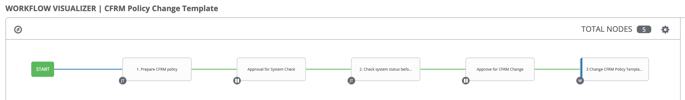
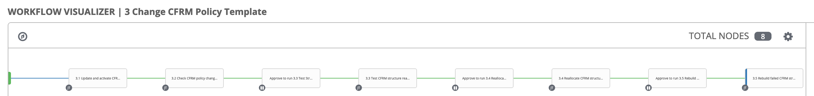

# Demo Playbook - CFRM Policy Change
This directory contains sample playbooks to demonstrate the auto-operation scenario for CFRM Policy Change.


## Scenario Introduction
CFRM Policy Change is a regular standardized operation on z/OS systems in the production environment, which contains below steps:

1. Prepare CFRM policy ([demo_step1_prepare_cfrm_policy.yml](demo_step1_prepare_cfrm_policy.yml)):

    * Report all CFRM policies on the target z/OS system by submitting the JCL file [POLPRT](files/POLPRT).
    
    * Generate the modified CFRM policy file `CFRM00` according to the sample text file [cfrm_policy_change.txt](files/cfrm_policy_change.txt).

2. Check system status before CFRM policy change ([demo_step2_check_system_status_before_change.yml](demo_step2_check_system_status_before_change.yml)):

    * Issue the following MVS commands on the target z/OS system to check system status before CFRM policy change and save the command response.
        ```
        D XCF,POL,TYPE=CFRM
        D CF
        D XCF,CF,CFNAME=ALL
        D XCF,STR
        D XCF,STR,STRNM
        ```

3. Change CFRM policy:

    3.1. Active the modified CFRM policy ([demo_step3.1_active_cfrm_policy.yml](demo_step3.1_active_cfrm_policy.yml)):
    
    * Update the modified CFRM policy on the target z/OS system by submitting the JCL file [POLUPD](files/POLUPD).

    * Issue the following MVS command on the target z/OS system to active the modified CFRM policy and save the command response.
        ```
        SETXCF START,POLICY,TYPE=CFRM,POLNAME={{ cfrm_policy_to_be_modified }}
        ```

    3.2. Check CFRM policy change pending ([demo_step3.2_check_cfrm_policy_change_pending.yml](demo_step3.2_check_cfrm_policy_change_pending.yml)):

    * Issue the following MVS command on the target z/OS system to check CFRM policy change pending and save the command response. If there is any change pending, you can manually fix the pending and run this step again, or continue to next step.
        ```
        D XCF,STR
        ```

    3.3. Test CFRM structure REALLOCATE process ([demo_step3.3_test_cfrm_structure_reallocate.yml](demo_step3.3_test_cfrm_structure_reallocate.yml)):

    * Issue the following MVS command on the target z/OS system to test CFRM structure REALLOCATE process and save the command response. You can check the test result and continue to next step.
        ```
        D XCF,REALLOCATE,TEST
        ```

    3.4. Active the modified CFRM structures ([demo_step3.4_active_cfrm_structures.yml](demo_step3.4_active_cfrm_structures.yml)):

    * Issue the following MVS command on the target z/OS system to active the modified CFRM structures and save the command response.
        ```
        SETXCF START,REALLOCATE
        ```
    
    * Issue the following MVS commands on the target z/OS system to check system status after CFRM policy change and save the command response. If there is any CFRM structure failed to active, you can run next step to rebuild the failed CFRM structures.
        ```
        D XCF,POL,TYPE=CFRM
        D XCF,STR
        D XCF,CF,CFNAME=ALL
        ```

    3.5. (Optional) Rebuild the failed CFRM structures ([demo_step3.5_rebuild_failed_cfrm_structures.yml](demo_step3.5_rebuild_failed_cfrm_structures.yml)):
    
    * For each of the failed CFRM structures, issue the following MVS commands on the target z/OS system to rebuild it and save the command response.
        ```
        D XCF,STR,STRNM={{ cfrm_structure_to_be_rebuilt }}
        SETXCF START,REBUILD,STRNM={{ cfrm_structure_to_be_rebuilt }}
        SETXCF START,ALTER,STRNM={{ cfrm_structure_to_be_rebuilt }},SIZE={{ size_of_cfrm_structure_to_be_rebuilt }}
        ```


## Pre-requisites
* [POLPRT](files/POLPRT): Sample JCL file to be used to report all CFRM policies on the target z/OS system.
    ```
    //POLPRT JOB ,,CLASS=A,MSGCLASS=X,MSGLEVEL=(1,1),NOTIFY=&SYSUID
    //CFRMPOL   EXEC PGM=IXCMIAPU
    //SYSPRINT  DD  SYSOUT=*
    //SYSIN     DD  *
    DATA TYPE(CFRM)  REPORT(YES)
    //*
    ```

* [POLUPD](files/POLUPD): Sample JCL file to be used to update the modified CFRM policy file on the target z/OS system. In this JCL file, the dataset `ZOSMF.DEMO.JCL` is used to contain all JCL files on the target z/OS system. You can specify it via `jcl_dataset` variable defined in a group specific variable file [mySystems.yml](group_vars/mySystems.yml) under directory "group_vars". `CFRM00` is the modified CFRM policy file  which is generated according to the sample text file [cfrm_policy_change.txt](files/cfrm_policy_change.txt).
    ```
    //POLUPD JOB ,,CLASS=A,MSGCLASS=X,MSGLEVEL=(1,1),NOTIFY=&SYSUID
    //CFRMPOL   EXEC PGM=IXCMIAPU
    //SYSPRINT  DD  SYSOUT=*
    //SYSIN     DD  DISP=SHR,DSN=ZOSMF.DEMO.JCL(CFRM00)
    //*
    ```

* [cfrm_policy_change.txt](files/cfrm_policy_change.txt): Sample text file containing JSON object to be used to specify which CFRM policy and its structures will be modified, and the new value of the structure params to be modified. You can modify it according to your own environment.
    ```
    {
        "policy_name": "CTTEST1",
        "changed_structures": {
            "LIST02": {
                "SIZE": "2120K",
                "INITSIZE": "1102K"
            },
            "LIST32": {
                "SIZE": "1120K",
                "INITSIZE": "1002K"
            }
        }
    }
    ```

* [modify_policy.py](files/modify_policy.py): Sample python script to be used to generate the modified CFRM policy file according to the sample text file [cfrm_policy_change.txt](files/cfrm_policy_change.txt).


## Configuration and Setup
To run the sample playbooks, below preparation works are required:

### Inventory
Included in this directory is a sample inventory file [hosts](hosts) that with little modification can be used to manage the target z/OS systems. This inventory file should be included when running the sample playbooks.
```
[mySystems]
system1 
system2
```
* `mySystems`: Host group to manage the target z/OS systems.

* `system1`: Nickname for the target z/OS system. You can modify it to refer to your own z/OS system.

### Group Vars
Included in this directory is a sample group specific variable file [mySystems.yml](group_vars/mySystems.yml) under directory "group_vars".
```
zmf_host: your.host.name
zmf_port: port_number
zmf_user: your_username
zmf_password: your_password
jcl_dataset: "ZOSMF.DEMO.JCL"
local_input_dir: "files"
local_output_dir: "/tmp/demo_output"
```
* `zmf_host`: The value of this property identifies the hostname of the z/OS system on which z/OSMF server is running on.

* `zmf_port`: The value of this property identifies the port number of z/OSMF server.

* `zmf_user`: The value of this property identifies the username to be used for authenticating with z/OSMF server.

* `zmf_password`: The value of this property identifies the password to be used for authenticating with z/OSMF server.

* `jcl_dataset`: The dataset to be used to contain JCL files on the target z/OS system.

* `local_input_dir`: The path of directory to keep JCL files, python script file and text file on control node.

* `local_output_dir`: The path of directory to save output on control node.


## Setup in AWX
[AWX](https://github.com/ansible/awx) provides a web-based user interface, REST API, and task engine built on top of Ansible. To install AWX, please view the [Install Guide](https://github.com/ansible/awx/blob/devel/INSTALL.md).

Below is a sample template workflow for your reference to setup the project of CFRM Policy Change in AWX:






## Copyright
© Copyright IBM Corporation 2020