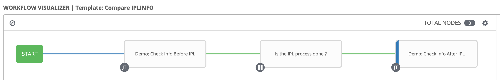

# Demo Playbook - IPL INFO Check
This directory contains sample playbooks to demonstrate the auto-operation scenario for IPL INFO Check.


## Scenario Introduction
IPL INFO Check is a regular standardized operation on z/OS systems in the production environment, which contains below steps:

1. Get system information before IPL ([demo_ipl_1_get_info_before_ipl.yml](demo_ipl_1_get_info_before_ipl.yml)):

    * Report the current system information before IPL by issuing the following MVS command to submit the JCL file `IPLCONF` on all z/OS systems in one sysplex. The JCL file `IPLCONF` will put the reported system information before IPL into the specified output PDS (`RPT.SYSINFO.{{ system_nickname }}.ONETIME`).

        ```
        RO *ALL,S IPLCONF
        ```

    * For each submitted job, query its status and search the output PDS name in its spool files after the job is completed. 

    * For each output PDS, retrieve the content of its members and save to control node.

2. Get system information after IPL ([demo_ipl_2_get_info_after_ipl.yml](demo_ipl_2_get_info_after_ipl.yml)):

    * Report the current system information after IPL by issuing the following MVS command to submit the JCL file `IPLCONF` again on all z/OS systems in one sysplex. The JCL file `IPLCONF` will put the reported system information after IPL into the specified output PDS (`RPT.SYSINFO.{{ system_nickname }}.IPL`).

        ```
        RO *ALL,S IPLCONF,DSSUF=IPL
        ```

    * For each submitted job, query its status and search the output PDS name in its spool files after the job is completed. 

    * For each output PDS, retrieve the content of its members and save to control node.

    * Run the python script file [compare_pds.py](files/compare_pds.py) to compare the contents of output PDS before and after IPL, and generate a html to show the compare result.

### As-Is VS To-Be
**As-Is (Without Ansible - Manually operate the IPL info check):**
* Repeated effort of manual actions.
* A lot manual actions will cause pressure and risk during the limited time window.
* z/OS admin need to manually switch between the output PDS before and after IPL to compare them.

**To-Be (With Ansible and IBM z/OSMF Ansible collection `ibm_zos_zosmf`):**
* Avoid repeat effort (same template can be run against same or different hosts with one click).
* Less error-prone due to predefined process in Ansible playbooks.
* Visualize the compare result of the output PDS before and after IPL via running the python script file in Ansible playbooks.
* Automation increases efficiency.
* Archive the output of each auto-operation.


## Pre-requisites
* `IPLCONF`: Sample JCL file to be used to report the current system information. In this JCL file, you should specify the output partitioned data set (PDS) which will contain the reported system information as its members. For example, you can specify `RPT.SYSINFO.{{ system_nickname }}.ONETIME` as the output PDS name before IPL, and `RPT.SYSINFO.{{ system_nickname }}.IPL` as the output PDS name after IPL.

* [compare_pds.py](files/compare_pds.py): Sample python script to be used to compare the contents of output PDS before and after IPL, and generate a html to show the compare result.


## Configuration and Setup
To run the sample playbooks, below preparation works are required:

### Inventory
Included in this directory is a sample inventory file [hosts](hosts) that with little modification can be used to manage the target z/OS systems. This inventory file should be included when running the sample playbooks.
```
[mySystems]
system1 
system2
```
* `mySystems`: Host group to manage the target z/OS systems.

* `system1`: Nickname for the target z/OS system. You can modify it to refer to your own z/OS system.

### Group Vars
Included in this directory is a sample group specific variable file [mySystems.yml](group_vars/mySystems.yml) under directory "group_vars".
```
zmf_host: your.host.name
zmf_port: port_number
zmf_user: your_username
zmf_password: your_password
local_script_path: "files/compare_pds.py"
local_output_dir: "/tmp/demo_output"
```
* `zmf_host`: The value of this property identifies the hostname of the z/OS system on which z/OSMF server is running on.

* `zmf_port`: The value of this property identifies the port number of z/OSMF server.

* `zmf_user`: The value of this property identifies the username to be used for authenticating with z/OSMF server.

* `zmf_password`: The value of this property identifies the password to be used for authenticating with z/OSMF server.

* `local_script_path`: The path of python script file on control node.

* `local_output_dir`: The path of directory to save output on control node.


## Setup in AWX
[AWX](https://github.com/ansible/awx) provides a web-based user interface, REST API, and task engine built on top of Ansible. To install AWX, please view the [Install Guide](https://github.com/ansible/awx/blob/devel/INSTALL.md).

Below is a sample template workflow for your reference to setup the project of IPL INFO Check in AWX:




## Copyright
© Copyright IBM Corporation 2020