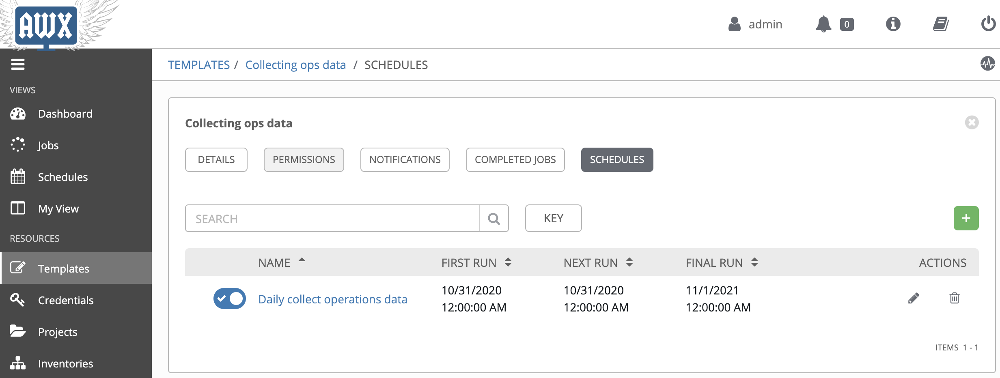

# Demo Playbook - Collect operations data
This directory contains a sample playbook to demonstrate the auto-operation scenario for collecting daily operations data and store it to the DB.

## Scenario Introduction
Normally, the z/OS admin submits JCL to collect operations data to some data sets and download the data to some linux platforms for further analysis. Generally, the data will be put into DBs(Redis, MongoDB, etc.), and a customized UI will be used to demonstrate the operations data for reviewing.
This case demonstrates the automation of whole process with below assumptions:

* We use a sample JCL `CLCTLOG` to simulate the process of collecting operations data. In the real environment, the JCL may be more complicated.

* A Redis DB installed on linux platform is used for storing the downloaded operation data. 

This playbook ([`demo_ops_data_collect.yml`](demo_ops_data_collect.yml)) contains 2 plays:

1. The first play communications with z/OS via z/OSMF to collect and download operations data. Host `zOS` is configured for this play to indicate the z/OS system to communicate. 2 tasks are contained in this play:
    
    * The first task uses z/OSMF Ansible collection's role - `zosmf_job_complete` to submit the job [`CLCTLOG`](files/CLCTLOG.jcl) to collect the operations data, the job will copy the data to a data set `OPS.DATA.&DATE`, `&DATE` is different based on the date when you running the playbook.

    * The second task uses Ansible's `URI` module to retrieve the content of data set `OPS.DATA.&DATE` via _z/OSMF data set and file REST interface_ and register it to a variable `ops_data` for later use.

2. The second play communications with the linux-like system on which the Redis DB is running. The host `linux` is configured for the play.

    * Ansible's `shell` module is used to run the command `redis cli hset` to insert the previously register variable `ops_data` to the Redis DB which is running on the linux-like system.

### As-Is VS To-Be

* **As-Is (Without Ansible):**
    - z/OS admins need to manually run the job and download z/OS operation data to a certain place in distributed platform. 
    - Linux admins need to collect the z/OS operation data from the certain place and insert it to Redis DB after z/OS admins done their own job. 
    - If there is any problem happens, z/OS admins need to communicate with x86 admins to figure out which step was failed together. 
    - Repeated effort for both z/OS admins and x86 admins. 

* **To-Be (With Ansible and IBM z/OSMF Ansible collection):**
    - Ansible Playbook covers automation on both z/OS and Linux side to avoid repeat effort.
    - z/OS admins and Linux admins could implement their own automation with same language (YAML)
    - Easy to figure out which step was failed.

## Pre-requisites
* `CLCTLOG`: Sample JCL file to simulate the process of collecting the operations data to a data set, the JCL will copy the content from `OPS.DATA.TMP` to `OPS.DATA.&DATE`, variable `&DATE` is different based on the date when running the playbook. The data set `OPS.DATA.TMP` needs to be prepared before running this case.

* A Redis DB runs on the linux system is used for storing the operations data retrieved from z/OS side. The key of the operations data is `opslog`, the field is in format of `YYYYMMDD`, for example, if you run the playbook on Nov 1st, 2020, then the related field is `20201101`.

## Configuration and Setup
To run the sample playbooks, below preparation works are required:

### Inventory
Included in this directory is a sample inventory file [hosts](hosts) that with little modification can be used to manage the target z/OS system and other linux-like system. This inventory file should be included when running the sample playbooks. `host_vars` is used to configure the systems. 
```
zos
linux
```

### Host Vars
Included in `host_vars` directory are sample host specific variable files [zos.yml](host_vars/zos.yml) and [linux.yml](host_vars/linux.yml) under directory "host_vars".

#### zos.yml
This file contains variables used by z/OSMF collection to communicate with z/OSMF.
```yml
zmf_host: your.host.name
zmf_port: port_number
zmf_user: your_username
zmf_password: your_password
```
* `zmf_host`: The value of this property identifies the hostname of the z/OS system on which z/OSMF server is running on.

* `zmf_port`: The value of this property identifies the port number of z/OSMF server.

* `zmf_user`: The value of this property identifies the username to be used for authenticating with z/OSMF server.

* `zmf_password`: The value of this property identifies the password to be used for authenticating with z/OSMF server.

#### linux.yml
This file contains variables used by Ansible to connect with the related linux system. Normally, the connection type is SSH.
```yml
ansible_host: linux.host 
ansible_connection: ssh 
ansible_user: username 
ansible_password: password
```

## Setup in AWX
[AWX](https://github.com/ansible/awx) provides a web-based user interface, REST API, and task engine built on top of Ansible. To install AWX, please view the [Install Guide](https://github.com/ansible/awx/blob/devel/INSTALL.md).

With AWX, you can configure the playbook as a template, and run the template daily by adding schedules to the template.



## Copyright
© Copyright IBM Corporation 2020